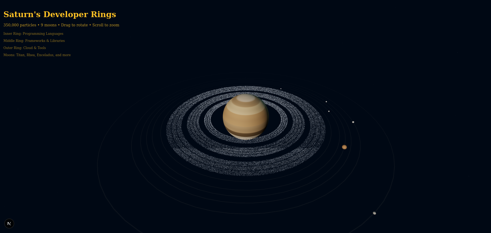

# 🎨 3D Designs Collection

A showcase of interactive 3D web elements built with modern web technologies by VonHoltenCodes.


<p align="center">
  
</p>

<table align="center">
  <tr>
    <td align="center">
      
      <br><em>Developer Tools Globe</em>
    </td>
    <td align="center">
      
      <br><em>DNA Double Helix</em>
    </td>
    <td align="center">
      
      <br><em>Saturn's Rings</em>
    </td>
  </tr>
  <tr>
    <td align="center">
      
      <br><em>Luxury Aviation Hero</em>
    </td>
    <td align="center">
      <!-- Placeholder for future project -->
    </td>
    <td align="center">
      <!-- Placeholder for future project -->
    </td>
  </tr>
</table>

## 🌟 Overview

This repository houses various 3D interactive elements designed for web integration, showcasing the power of WebGL and modern JavaScript frameworks. Each project demonstrates unique 3D concepts while maintaining high performance and visual appeal.

## 🚀 Projects

### 1. [Developer Tools Globe](./developer-tools-globe/)
An interactive 3D globe featuring 35+ developer tool logos with particle animations and smooth interactions.
- **Status**: ✅ REV1 Complete
- **[Live Demo](#)** | **[Documentation](./developer-tools-globe/README.md)**

### 2. [DNA Double Helix](./dna-double-helix/)
A scientifically accurate 3D visualization of the DNA double helix structure with interactive controls and educational features.
- **Status**: ✅ REV1 Complete
- **[Live Demo](#)** | **[Documentation](./dna-double-helix/DOUBLE_HELIX_README.md)**
- **Features**: Watson-Crick base pairing, glowing phosphate backbone, floating H₂O molecules, educational mode

### 3. [Saturn's Rings](./saturns-rings/)
A stunning representation of Saturn with developer tool particles orbiting in its majestic rings, complete with realistic moons.
- **Status**: ✅ REV1 Complete
- **[Live Demo](#)** | **[Documentation](./saturns-rings/README.md)**
- **Features**: 350,000 particles, 9 orbiting moons, developer tools as ring particles, procedural textures

### 4. [Luxury Aviation Hero](./luxury-aviation-hero/)
A photorealistic 3D hero section featuring an interactive Boeing 737-800 aircraft with HDRI sunset lighting and mouse controls.
- **Status**: ✅ REV1 Complete
- **[Live Demo](#)** | **[Documentation](./luxury-aviation-hero/README.md)**
- **Features**: Boeing 737-800 model, interactive mouse controls, HDRI environment, automatic scaling

### More projects coming soon...

## 🛠️ Tech Stack

- **Framework**: [Next.js 15](https://nextjs.org/) with TypeScript
- **3D Graphics**: [Three.js](https://threejs.org/) + [React Three Fiber](https://docs.pmnd.rs/react-three-fiber)
- **Animations**: [Framer Motion](https://www.framer.com/motion/)
- **Styling**: [Tailwind CSS v4](https://tailwindcss.com/)
- **Post-processing**: [@react-three/postprocessing](https://github.com/pmndrs/postprocessing)

## 🚀 Quick Start

```bash
# Clone the repository
git clone https://github.com/VonHoltenCodes/three-d-designs.git

# Navigate to a specific project
cd three-d-designs/developer-tools-globe

# Install dependencies
npm install

# Run development server
npm run dev
```

## 📁 Repository Structure

```
three-d-designs/
├── developer-tools-globe/    # REV1 - Interactive technology globe
├── dna-double-helix/        # REV1 - DNA structure visualization
├── saturns-rings/           # REV1 - Saturn with animated rings
├── luxury-aviation-hero/    # REV1 - Boeing 737 hero section
├── screenshots/             # Project screenshots and animations
├── docs/                    # Shared documentation
└── shared/                  # Shared utilities and components
```

## 👤 Author

**VonHoltenCodes**
- GitHub: [@VonHoltenCodes](https://github.com/VonHoltenCodes)

## 🙏 Acknowledgments

- **[Claude by Anthropic](https://claude.ai)** - AI-powered code generation and development assistance
- **[Three.js Community](https://threejs.org/)** - For the amazing 3D graphics library
- **[React Three Fiber](https://docs.pmnd.rs/react-three-fiber)** - For React integration
- **[Simple Icons](https://simpleicons.org/)** - Technology logo resources

## 📄 License

This project is licensed under the MIT License - see the [LICENSE](LICENSE) file for details.

## 🤝 Contributing

Contributions, issues, and feature requests are welcome! Feel free to check the [issues page](https://github.com/VonHoltenCodes/three-d-designs/issues).

1. Fork the Project
2. Create your Feature Branch (`git checkout -b feature/AmazingFeature`)
3. Commit your Changes (`git commit -m 'Add some AmazingFeature'`)
4. Push to the Branch (`git push origin feature/AmazingFeature`)
5. Open a Pull Request

## 📊 Project Status

This repository is actively maintained and new 3D elements are regularly added. Each project follows semantic versioning with REV tags for major updates.

---

<p align="center">
  Made with ❤️ by VonHoltenCodes | Powered by 🤖 Claude
</p>