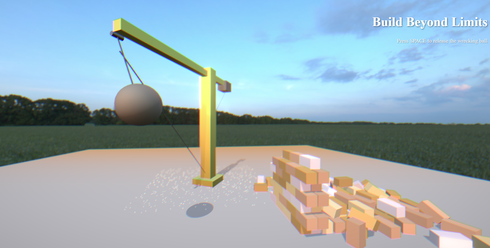

# Construction Hero - Interactive 3D Hero Section



## Overview

Construction Hero is an ultra-realistic, interactive 3D hero section designed for the construction industry. It features a physics-based tower crane with a swinging wrecking ball that can demolish a brick wall, all rendered with cutting-edge web 3D technology.

## Demo


## Features

### Interactive Controls
- **Mouse Movement**: Control crane rotation by moving your mouse horizontally
- **Camera Control**: Click and drag to rotate the camera view
- **Spacebar**: Press SPACE to release the wrecking ball
- **Zoom**: Use scroll wheel to zoom in/out

### Ultra-Realistic Visuals (REV2)
- **HDRI Environment Mapping**: Industrial sunset environment with realistic reflections
- **PBR Materials**: Physically-based rendering for all objects
- **Post-Processing Effects**: Bloom, depth of field, vignette, and chromatic aberration
- **Dynamic Dust Particles**: 500 particles triggered on impact
- **Advanced Lighting**: Three-point lighting setup with 4K shadow maps
- **Atmospheric Effects**: Fog for depth perception

### Physics Simulation
- **Realistic Pendulum Motion**: Wrecking ball swings naturally with crane movement
- **Destructible Wall**: 120 individual physics-enabled bricks
- **Impact Detection**: Automatic dust effect generation on collision
- **Debris Cleanup**: Automatic removal after 5 seconds

## Tech Stack

- **Next.js 15** with App Router and Turbopack
- **Three.js** (v0.178.0) for 3D graphics
- **React Three Fiber** (v9.2.0) for declarative 3D
- **Rapier Physics Engine** (v0.17.3) for realistic physics
- **@react-three/postprocessing** for visual effects
- **TypeScript** for type safety
- **Tailwind CSS v4** for styling

## Installation

```bash
# Clone the repository
git clone https://github.com/yourusername/construction-hero.git

# Install dependencies
npm install

# Run development server
npm run dev
```

Open [http://localhost:3000](http://localhost:3000) to view the project.

## Performance

The project includes an adaptive quality system that automatically adjusts rendering settings based on device performance:
- **High Quality**: Full effects with 2x pixel ratio
- **Medium Quality**: Reduced effects with 1.5x pixel ratio
- **Low Quality**: Minimal effects with 1x pixel ratio

## Project Structure

```
construction-hero/
├── app/
│   ├── page.tsx          # Main scene with HDRI and post-processing
│   ├── layout.tsx        # Root layout
│   └── globals.css       # Global styles
├── components/
│   ├── Crane.tsx         # Interactive crane with PBR materials
│   ├── WreckingBall.tsx  # Physics-based wrecking ball
│   ├── DestructibleWall.tsx # Breakable brick wall
│   ├── DustParticles.tsx # Particle system for impacts
│   └── PerformanceMonitor.tsx # FPS monitoring and quality adjustment
├── public/
│   ├── hdri/            # HDRI environment maps
│   └── models/          # 3D models (future enhancement)
└── README_REV2.md       # Detailed REV2 documentation
```

## REV2 Enhancements

The second revision brings ultra-realistic visuals comparable to luxury aviation hero sections:

1. **Environmental Lighting**: 4K HDRI from Poly Haven
2. **Material Upgrades**: All objects use PBR materials with proper metalness and roughness
3. **Post-Processing Pipeline**: Cinema-quality effects
4. **Particle Effects**: Dynamic dust system
5. **Performance Optimization**: Smart quality adjustment

See [README_REV2.md](./README_REV2.md) for detailed technical information.

## Future Enhancements

- High-quality 3D crane models from Sketchfab
- Additional HDRI environments
- PBR texture maps (normal, roughness, metalness)
- Screen space reflections
- Volumetric lighting effects

## License

MIT License - feel free to use this in your projects!

## Credits

- HDRI Environment: [Poly Haven](https://polyhaven.com)
- Built with [Three.js](https://threejs.org) and [React Three Fiber](https://docs.pmnd.rs/react-three-fiber)
- Physics by [Rapier](https://rapier.rs)