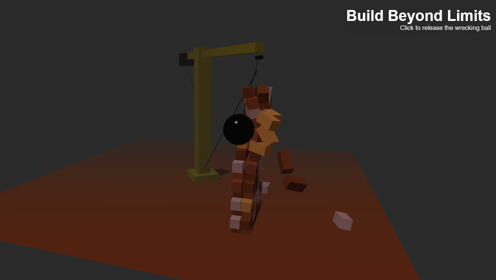

# Construction Hero - Interactive 3D Construction Scene

An ultra-realistic 3D hero section for the construction industry featuring an interactive tower crane with physics-based wrecking ball and destructible brick wall system.



## Features

- **Interactive Tower Crane**: 
  - Smooth mouse-controlled rotation
  - Realistic metallic materials and construction details
  - Support cables and counterweight visualization
- **Physics-Based Wrecking Ball**: 
  - Realistic pendulum motion with proper swinging physics
  - Dynamic cable that stretches and adjusts
  - Spherical joint physics for natural movement
  - Click to release mechanism
- **Destructible Wall System**: 
  - 120 individual physics-enabled bricks
  - Multi-layer wall construction (2 layers thick)
  - Realistic brick destruction on impact
  - Automatic debris cleanup after 5 seconds
- **Optimized Performance**: 
  - Efficient brick count for smooth physics
  - Dark themed environment for better visibility
  - Responsive controls and camera system

## Technologies

- **Next.js 15** with App Router
- **Three.js** + **React Three Fiber**
- **Rapier Physics Engine** for realistic physics
- **TypeScript** for type safety
- **Tailwind CSS** for styling
- **@react-three/drei** for 3D utilities

## Getting Started

```bash
# Install dependencies
npm install

# Run development server
npm run dev
```

Visit http://localhost:3000 to see the construction hero section.

## Project Structure

```
construction-hero/
├── app/
│   └── page.tsx          # Main hero component
├── components/
│   ├── Crane.tsx         # Crane model and controls
│   ├── WreckingBall.tsx  # Physics-based wrecking ball
│   └── Wall.tsx          # Destructible wall component
├── public/
│   ├── models/
│   │   ├── crane.glb     # Tower crane model
│   │   └── debris.glb    # Debris pieces
│   └── hdri/
│       └── construction_site_8k.exr  # Environment map
```

## Assets Needed

1. **Tower Crane Model** - Photorealistic crane (GLB format)
2. **Wrecking Ball** - Metal sphere with chain
3. **Brick Wall** - Modular bricks for destruction
4. **HDRI Environment** - Construction site ambiance

## Usage

Move your mouse left and right to control the crane rotation. The wrecking ball will follow the crane's movement with realistic swinging physics. Click anywhere to release the wrecking ball - watch as it swings and demolishes the brick wall!

## Development Status

- [x] Project setup with Next.js and Three.js
- [x] Physics engine integration (Rapier)
- [x] Crane model with interactive controls
- [x] Wrecking ball physics with swinging motion
- [x] Destructible wall system with individual bricks
- [x] Mouse-based crane controls
- [x] UI overlay with instructions
- [x] Performance optimization for smooth physics

## Performance Notes

This project uses intensive physics simulation. For best performance:
- Use a modern browser with WebGL support
- Chrome or Edge recommended for optimal performance
- May require dedicated GPU for smooth operation
- Reduced brick count optimized for broader compatibility

## License

MIT License

---

Built with ❤️ for the construction industry
