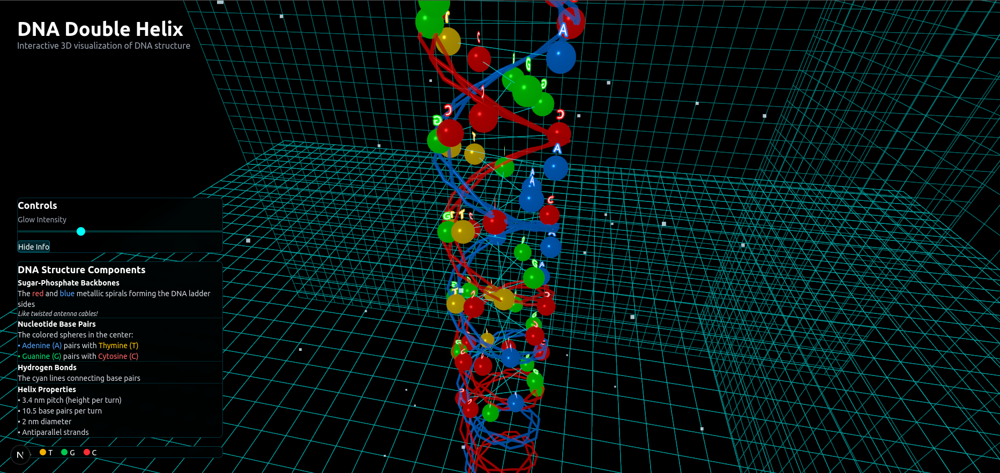
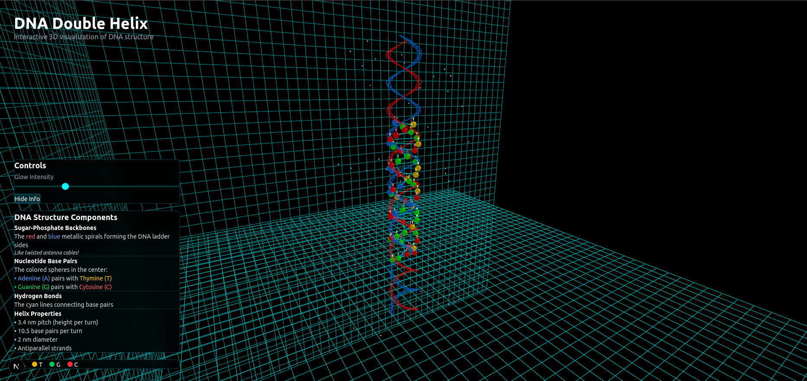

# 🧬 DNA Double Helix Visualization

An interactive 3D visualization of the DNA double helix structure with scientifically accurate base pairing, educational features, and stunning visual effects.


## 🔬 Overview

Experience the beauty of life's blueprint through an immersive 3D DNA double helix visualization. This educational tool combines scientific accuracy with captivating visual effects to bring molecular biology to life. Perfect for students, educators, and anyone fascinated by the building blocks of life.

## 📸 Screenshots

<div align="center">
  
  <br><br>
  <table>
    <tr>
      <td align="center">
        
        <br><em>Close-up view showing base pair details</em>
      </td>
      <td align="center">
        
        <br><em>Full helix structure with particle effects</em>
      </td>
    </tr>
  </table>
</div>

## ✨ Features

- **Scientifically Accurate Structure**:
  - 🧬 Proper Watson-Crick base pairing (A-T, G-C)
  - 🌀 Authentic right-handed helix geometry
  - 📏 Accurate 3.4 Å base pair spacing
  - 🔄 10.5 base pairs per helical turn
- **Visual Effects**:
  - ✨ Soft glowing phosphate backbone
  - 💧 Floating H₂O molecules particle system
  - 🔤 Animated nucleotide letters (A, T, G, C)
  - 📐 Orthogonal grid background for depth perception
  - 🌟 Bloom and glow post-processing effects
- **Interactive Controls**:
  - 🖱️ Mouse drag to rotate view
  - 📱 Touch gestures for mobile devices
  - 🔍 Scroll to zoom in/out
  - ⏯️ Play/pause rotation animations
- **Educational Features**:
  - 📊 Interactive information panels
  - 🏷️ Nucleotide labeling system
  - 📖 Detailed molecular structure tooltips
  - 🎯 Highlight specific base pairs on hover

## 🛠️ Technology Stack

- **Framework**: Next.js 15.3.4 with TypeScript
- **3D Engine**: Three.js + React Three Fiber
- **Animations**: Framer Motion
- **Styling**: Tailwind CSS v4
- **Post-processing**: @react-three/postprocessing
- **Build Tool**: Turbopack

## 📦 Installation

```bash
# Clone the repository
git clone https://github.com/VonHoltenCodes/three-d-designs.git

# Navigate to the DNA helix project
cd three-d-designs/dna-double-helix

# Install dependencies
npm install

# Run development server (runs on port 3001)
npm run dev

# Build for production
npm run build
```

**Note**: The development server runs on port 3001 by default.

## 🏗️ Project Structure

```
dna-double-helix/
├── app/                    # Next.js app directory
│   ├── page.tsx           # Main page component
│   ├── layout.tsx         # Root layout
│   └── globals.css        # Global styles
├── components/            # React components
│   ├── DNAHelix3D.tsx     # Main 3D scene container
│   ├── DoubleHelix.tsx    # DNA structure geometry
│   ├── BasePair.tsx       # Individual base pair component
│   ├── PhosphateBackbone.tsx  # Glowing backbone effect
│   ├── WaterMolecules.tsx # H₂O particle system
│   ├── NucleotideLetters.tsx  # Floating A,T,G,C letters
│   ├── OrthogonalGrid.tsx # Background grid system
│   ├── InfoPanel.tsx      # Educational information display
│   └── LoadingScreen.tsx  # Loading state with DNA animation
├── hooks/                 # Custom React hooks
│   ├── useHelixControls.ts # Mouse/touch interactions
│   └── useEducationalMode.ts  # Educational features toggle
├── lib/                   # Utilities and data
│   ├── dnaStructure.ts    # DNA geometry calculations
│   ├── nucleotides.ts     # Base pair configurations
│   └── scientificData.ts  # Educational content
├── public/
│   └── textures/         # Molecular textures and patterns
└── scripts/              # Build and utility scripts
```

## 🧪 Scientific Details

### DNA Structure Specifications

- **Helix Parameters**:
  - Diameter: 2 nanometers (20 Å)
  - Pitch: 3.4 nanometers (34 Å)
  - Rise per base pair: 0.34 nanometers
  - Twist per base pair: 34.3°
  - Handedness: Right-handed (B-form DNA)

- **Base Pairing**:
  - Adenine (A) pairs with Thymine (T) - 2 hydrogen bonds
  - Guanine (G) pairs with Cytosine (C) - 3 hydrogen bonds
  - Purine-pyrimidine pairing maintains uniform helix width

- **Molecular Components**:
  - Sugar-phosphate backbone (deoxyribose sugars)
  - Nitrogenous bases (purines and pyrimidines)
  - Hydrogen bonds between complementary bases

## 🔧 Configuration Options

### Visual Settings
```typescript
// Helix appearance
helixRadius: 1.2,
basePairSpacing: 0.34,
rotationSpeed: 0.02,
glowIntensity: 0.8,

// Particle system
waterMoleculeCount: 200,
nucleotideLetterCount: 50,
particleSpeed: 0.5,

// Grid settings
gridSize: 20,
gridDivisions: 40,
gridOpacity: 0.3,
gridColor: '#00ff00'
```

### Performance Settings
- Target FPS: 60
- LOD (Level of Detail) for base pairs
- Particle count limits for mobile devices
- Adaptive quality based on device capabilities

### Educational Mode
- Toggle nucleotide labels
- Show/hide hydrogen bonds
- Display measurement overlays
- Interactive quiz mode

## 🎨 Customization

### Color Schemes
- **Nucleotides**:
  - Adenine: #FF6B6B (red)
  - Thymine: #4ECDC4 (cyan)
  - Guanine: #45B7D1 (blue)
  - Cytosine: #F7DC6F (yellow)
- **Backbone**: Soft phosphorescent green glow
- **Background**: Deep space black with subtle grid

### Animation Presets
1. **Gentle Rotation**: Slow, continuous spin
2. **Replication Mode**: Unzipping animation
3. **Transcription View**: RNA polymerase movement
4. **Educational Focus**: Paused with highlighting

## 🚀 Deployment

### Vercel (Recommended)
```bash
vercel --prod
```

### Docker Container
```bash
docker build -t dna-helix .
docker run -p 3001:3001 dna-helix
```

## 📊 Performance Metrics

- **Initial Load**: < 4s on 4G
- **Time to Interactive**: < 5s
- **Bundle Size**: ~600KB gzipped
- **Memory Usage**: ~180MB average
- **GPU Usage**: Moderate (WebGL 2.0)

## 🔮 Future Plans

- [ ] Version 1.1: RNA structure visualization mode
- [ ] Version 1.2: Protein synthesis animation
- [ ] Version 1.3: DNA replication process visualization
- [ ] Version 1.4: Mutation and repair mechanisms
- [ ] Version 1.5: VR/AR support for immersive learning
- [ ] Version 2.0: Full molecular dynamics simulation

## 🤝 Contributing

We welcome contributions from developers, scientists, and educators! Please see our [Contributing Guide](../CONTRIBUTING.md) for details.

### Areas for Contribution
- Additional educational content
- Performance optimizations
- Scientific accuracy improvements
- Accessibility features
- Multi-language support

## 👤 Author

**VonHoltenCodes**
- GitHub: [@VonHoltenCodes](https://github.com/VonHoltenCodes)
- Project: [three-d-designs](https://github.com/VonHoltenCodes/three-d-designs)

## 🙏 Acknowledgments

- **[Claude by Anthropic](https://claude.ai)** - AI-assisted development and code optimization
- **[Three.js](https://threejs.org/)** - Powerful 3D graphics library
- **[React Three Fiber](https://docs.pmnd.rs/react-three-fiber)** - React renderer for Three.js
- **[Protein Data Bank](https://www.rcsb.org/)** - Structural reference data
- **[NIH National Human Genome Research Institute](https://www.genome.gov/)** - Scientific accuracy consultation

## 📚 Educational Resources

- [DNA Learning Center](https://www.dnalc.org/)
- [Khan Academy - DNA Structure](https://www.khanacademy.org/science/biology)
- [Nature Education - DNA](https://www.nature.com/scitable/topic/dna-9)

## 📄 License

This project is licensed under the MIT License - see the [LICENSE](../LICENSE) file for details.

---

<p align="center">
  <strong>DNA Double Helix Visualization</strong><br>
  Part of the <a href="https://github.com/VonHoltenCodes/three-d-designs">3D Designs Collection</a><br>
  <em>Bringing molecular biology to life through interactive 3D visualization</em>
</p>