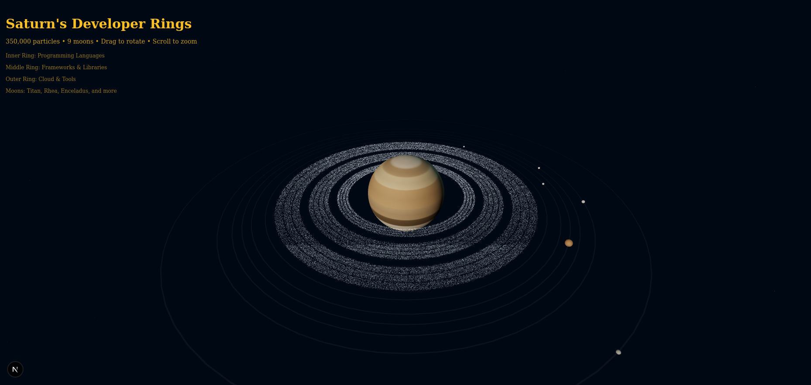

# 🪐 Saturn's Developer Rings

An awe-inspiring 3D visualization of Saturn featuring developer tool particles orbiting within its iconic ring system, complete with realistic moons and stunning visual effects.

<p align="center">
  
</p>

## 🌟 Features

### 🪐 Realistic Saturn
- **Procedural Texture Generation**: Dynamic banded atmosphere with color variations
- **Storm Features**: Subtle storm patterns reminiscent of Saturn's atmospheric dynamics
- **Smooth Rotation**: Realistic planetary rotation with optimized performance

### 💫 Three-Ring Particle System
- **350,000+ Particles**: Massive particle system creating realistic ring density
- **Developer Tool Integration**: Technology logos embedded as colored particles
  - **Inner Ring**: Programming Languages (JavaScript, TypeScript, Python, Rust, Go)
  - **Middle Ring**: Frameworks & Libraries (React, Vue.js, Node.js, Next.js, Angular)
  - **Outer Ring**: Cloud & Tools (AWS, Docker, GitHub, Claude, Vercel)
- **Realistic Structure**: Banded density variations with gaps between rings
- **Particle Composition**: Mix of ice (bluish-white) and rock (brownish) particles

### 🌙 Nine Orbiting Moons
- **Major Moons**: Titan, Rhea, Iapetus, Dione, Tethys
- **Inner Moons**: Enceladus (with glowing effect), Mimas
- **Shepherd Moons**: Prometheus, Pandora
- **Orbital Mechanics**: Different orbital speeds and distances
- **Visual Indicators**: Subtle orbital path lines

### ✨ Visual Effects
- **Advanced Lighting**: Dual light sources simulating sun and reflected light
- **Space Environment**: 3,000 background stars with proper depth
- **Post-processing**: Bloom effects for enhanced realism
- **Interactive Controls**: Smooth camera rotation and zoom

## 🚀 Getting Started

### Prerequisites
- Node.js 20.x or higher
- npm 10.x or higher

### Installation

```bash
# Clone the repository
git clone https://github.com/VonHoltenCodes/three-d-designs.git

# Navigate to Saturn's Rings
cd three-d-designs/saturns-rings

# Install dependencies
npm install

# Run development server
npm run dev
```

Visit `http://localhost:3000` to see Saturn's Rings in action!

## 🎮 Controls

- **Drag**: Rotate camera around Saturn
- **Scroll**: Zoom in/out
- **Limits**: Camera constrained to maintain optimal viewing angles

## 🛠️ Tech Stack

- **Next.js 15**: React framework with App Router
- **Three.js**: 3D graphics library
- **React Three Fiber**: React renderer for Three.js
- **TypeScript**: Type-safe development
- **Tailwind CSS v4**: Styling (minimal use)

## 📊 Performance

- **Optimized Particle Rendering**: Custom buffer geometries
- **Level of Detail**: Size attenuation for distant particles
- **Efficient Updates**: Minimal per-frame calculations
- **Memory Management**: Reused geometries and materials

## 🎨 Design Philosophy

This visualization combines scientific accuracy with creative expression, embedding the tools and technologies that power modern development within the natural beauty of Saturn's ring system. Each particle represents not just ice and rock, but the building blocks of our digital world.

## 🔧 Customization

### Modifying Rings
Edit ring configurations in `src/app/page.tsx`:
```typescript
const ringData = [
  { 
    inner: 15,      // Inner radius
    outer: 18,      // Outer radius
    particles: 80000, // Particle count
    speed: 0.02,    // Rotation speed
    // ... tool definitions
  }
]
```

### Adding Moons
Add new moons to the `moonsData` array:
```typescript
{ 
  name: 'NewMoon', 
  radius: 0.3, 
  distance: 50, 
  speed: 0.006, 
  color: '#FFFFFF' 
}
```

## 📈 Future Enhancements

- [ ] Ring shadows on Saturn
- [ ] Cassini Division (gap between rings)
- [ ] Interactive moon information
- [ ] Time controls for orbital speeds
- [ ] More developer tools and technologies

## 👤 Author

**VonHoltenCodes**
- GitHub: [@VonHoltenCodes](https://github.com/VonHoltenCodes)

## 🙏 Acknowledgments

- Inspired by NASA's Cassini mission imagery
- Three.js community for excellent documentation
- Claude by Anthropic for development assistance

## 📄 License

This project is licensed under the MIT License.

---

<p align="center">
  Made with ❤️ by VonHoltenCodes | Powered by 🤖 Claude
</p>